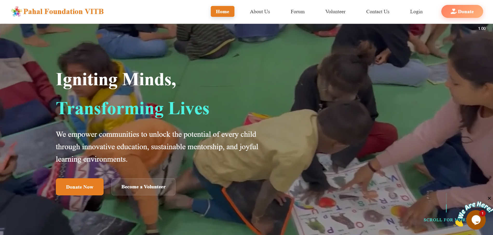
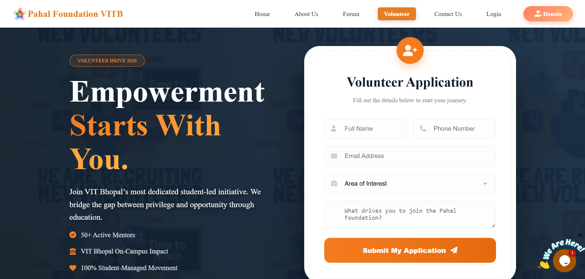
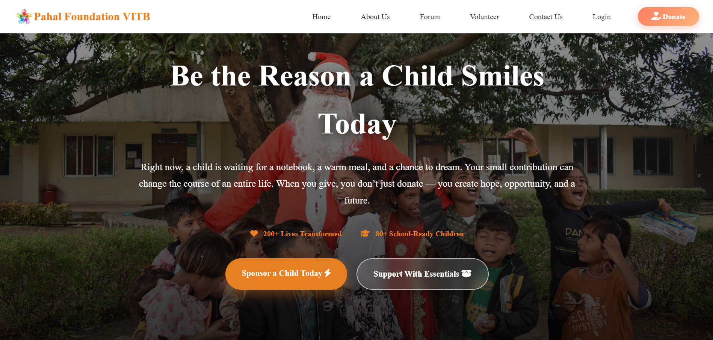
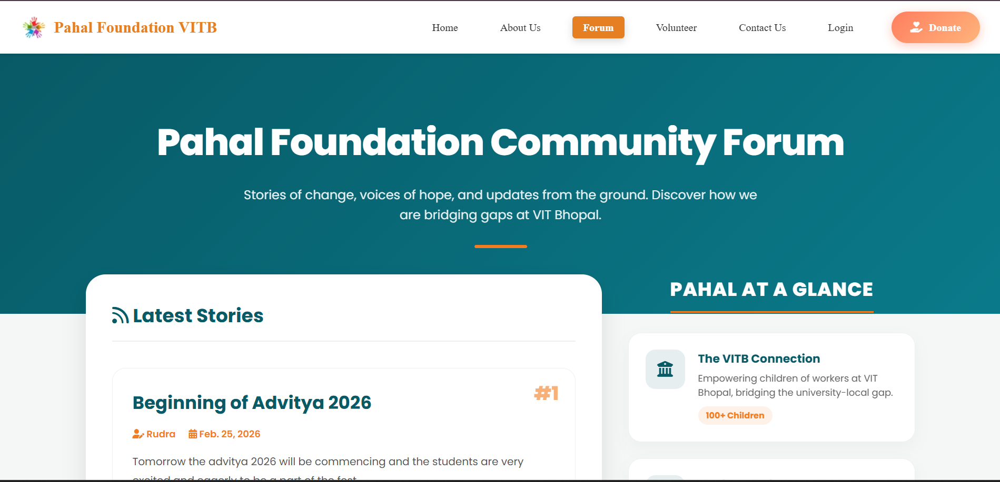
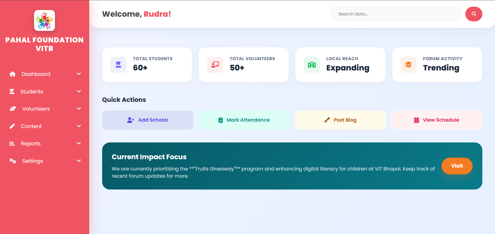
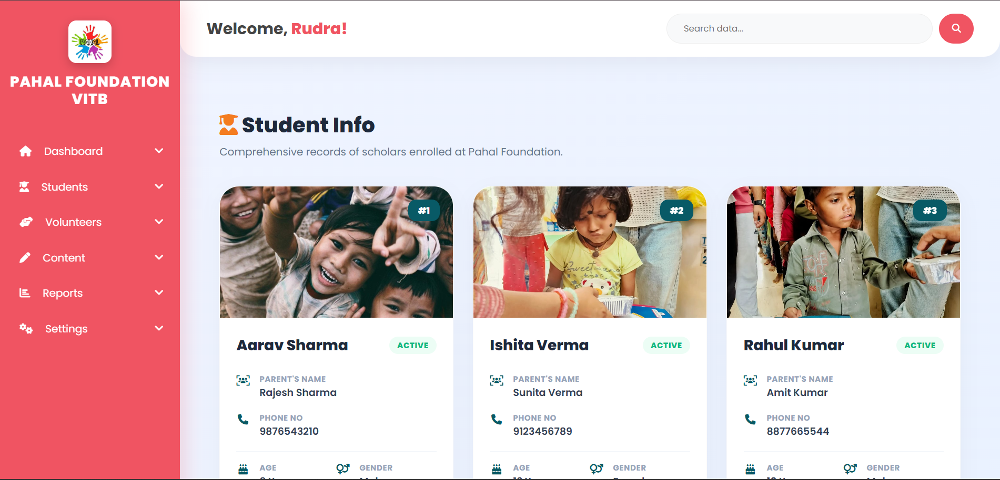
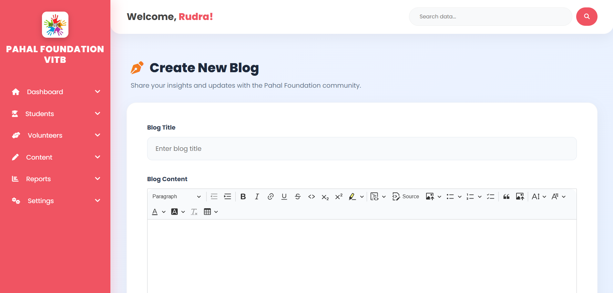
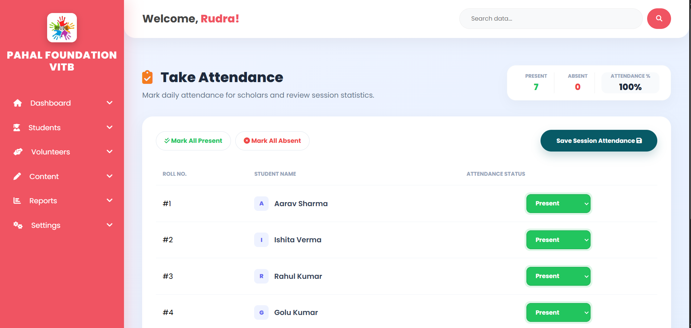

# Pahal Foundation NGO Web Application ✨

Welcome to the official repository for the Pahal Foundation's web application. This platform is a comprehensive tool designed to support the foundation's mission of empowering underprivileged students by providing educational resources, managing operations, and fostering a community of support.

Website link - [www.pahalfoundation.com](https://pahalfoundationvitb.onrender.com/)

## 🌟 About

Pahal Foundation is a non-profit organization committed to empowering underprivileged students, particularly the children of workers at VIT Bhopal. Our mission is to provide quality education and ensure their well-being through various initiatives. This web application serves as a central hub for our activities, helping us manage our programs, connect with volunteers, and engage with our community.

## 🚀 Key Features

-   **Homepage:** A welcoming landing page with an image slider, mission statement, and key statistics to showcase our impact.
-   **User Authentication:** Secure login and registration system for staff and administrators.
-   **Donation Portal:** Integrated with Razorpay for seamless and secure online donations.
-   **Content Management:**
    -   **Blog/Forum:** A platform for teachers and admins to create, edit, and publish articles. Includes a rich text editor and a commenting system for community engagement.
-   **Student Management System:**
    -   **Admissions:** An easy-to-use form for enrolling new students.
    -   **Student Database:** A central place to view and manage detailed student information.
    -   **Attendance Tracking:** Functionality for teachers to take and record daily attendance.
-   **Volunteer Management:**
    -   **Enrollment:** A dedicated form for new volunteers to register and join our cause.
    -   **Volunteer Database:** A directory of all volunteers and their information.
-   **Role-Based Access Control:**
    -   **Admin Dashboard:** Provides full access to all management features, including student and volunteer data, content management, and site settings.
    -   **Teacher Dashboard:** A tailored dashboard for teachers to manage their students, take attendance, and contribute to the blog.
-   **Responsive Design:** Ensures a seamless experience across desktops, tablets, and mobile devices.

## 🖼️ Screenshots

| Homepage | Volunteer Page |
| :---: |:---:|
|  |  |
| **Donation Page** | **Blog Page** |
|  |  |
| **Dashboard** | **Student Info Dashboard** |
| | |
| **Blog Creation Interface** | **Attendance Tracking** |
|  |  |

## 🛠️ Tech Stack

* **Backend:** Python, Django
* **Frontend:** HTML, CSS, JavaScript
* **Database:** MySQL
* **File Storage:** AWS S3 for media files.
* **Payment Gateway:** RazorPay.
* **Deployment:** Git, GitHub, Render.

## 📂 Project Structure
The project is organized into two main Django apps: pahal for the public-facing site and user authentication, and content for the internal dashboard and content management.

```
Pahal-Foundation-NGO/
├── .gitignore
├── CODE_OF_CONDUCT.md
├── LICENSE
├── PahalFoundation/
│   ├── .dockerignore
│   ├── Dockerfile
│   ├── manage.py
│   ├── PahalFoundation/
│   │   ├── __init__.py
│   │   ├── asgi.py
│   │   ├── ckeditorconfig.py
│   │   ├── settings.py
│   │   ├── urls.py
│   │   └── wsgi.py
│   ├── content/
│   │   ├── __init__.py
│   │   ├── admin.py
│   │   ├── apps.py
│   │   ├── decorators.py
│   │   ├── forms.py
│   │   ├── migrations/
│   │   │   ├── 0001_initial.py
│   │   │   ├── ...
│   │   │   └── __init__.py
│   │   ├── models.py
│   │   ├── static/
│   │   │   └── content/
│   │   │       ├── css/
│   │   │       └── js/
│   │   ├── templates/
│   │   │   └── content/
│   │   │       ├── admission.html
│   │   │       ├── ...
│   │   │       └── volunteer_info.html
│   │   ├── templatetags/
│   │   │   ├── __init__.py
│   │   │   └── group_tags.py
│   │   ├── tests.py
│   │   ├── urls.py
│   │   ├── views.py
│   │   ├── views_teacher.py
│   │   └── views_videos.py
│   └── pahal/
│       ├── __init__.py
│       ├── admin.py
│       ├── apps.py
│       ├── decorators.py
│       ├── migrations/
│       │   ├── 0001_initial.py
│       │   ├── ...
│       │   └── __init__.py
│       ├── models.py
│       ├── static/
│       │   └── pahal/
│       │       ├── css/
│       │       ├── icon/
│       │       └── js/
│       ├── templates/
│       │   └── pahal/
│       │       ├── aboutUs.html
│       │       ├── ...
│       │       └── volunteer.html
│       ├── tests.py
│       ├── urls.py
│       ├── views.py
│       ├── views_main_pages.py
│       └── views_teacher.py
├── README.md
├── requirements.txt
└── screenshots/
    ├── Screenshot (33).png
    ├── ...
    └── Screenshot (41).png     
```

## 🤝 Contributing

Contributions are what make the open-source community such an amazing place to learn, inspire, and create. Any contributions you make are **greatly appreciated**.

Please read `CODE_OF_CONDUCT.md` for details on our code of conduct and the process for submitting pull requests to us.

## 📄 License

Distributed under the MIT License. See `LICENSE` for more information.
